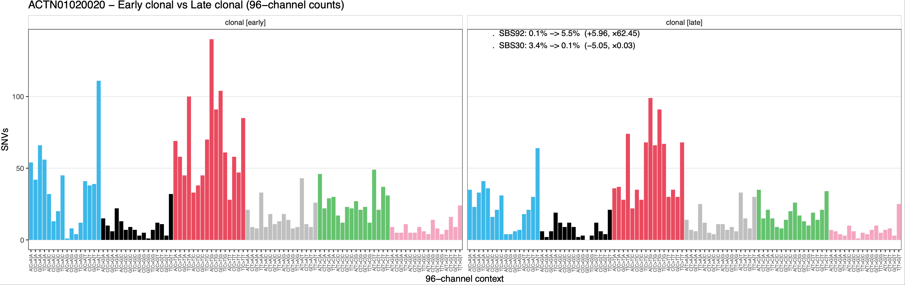

# CCGCM → MutationTimeR → Signature Timing  
### An Integrated Evolutionary Timing Workflow

This project implements an integrated workflow that bridges the gap between the **CCGCM production environment** and downstream **evolutionary timing analyses**.

Specifically, CCGCM outputs — somatic VCFs, PURPLE allele-specific copy number segmentation, and purity estimates — are adapted into the standardized input formats required by **MutationTimeR** for **mutation- and CNA-level timing**.

In addition, **Manta structural variant calls** are incorporated to enable downstream **breakpoint visualisation** in the final timing plots, even though SVs themselves are not used directly in timing inference.

The project includes extensive **script modifications** and **compatibility adjustments** to harmonize data schemas, CN representations, mutation-context extraction, and timing annotations—allowing seamless end-to-end analysis from raw CCGCM outputs to mutation- and CN-level timing results and their visual interpretation.

The workflow also integrates updated reference resources (e.g., the latest **COSMIC SBS/DBS signatures**) and provides batch-processing utilities for HPC queue-based execution across large cohorts.

Finally, the repository offers a overview of the underlying algorithms and discusses their general assumptions and limitations to help guide the interpretation of mutation and CNA timing results.

---

# 1. MutationTimeR

## Overview of the MutationTimeR Algorithm

**MutationTimeR** infers temporal ordering of somatic events by integrating:

- Variant allele frequencies (VAFs)  
- Allele-specific copy number  
- Subclonal architecture  

under a hierarchical probabilistic framework.

Key components:

- Mutant read counts are modeled with a **beta–binomial distribution** to allow over-dispersion.
- All biologically possible **mutation copy-number states (MutCN)** are enumerated for each mutation.
- An **EM algorithm** estimates the latent distribution of mutation states $ \pi_c $.
- These state proportions encode:
  - timing of **clonal vs subclonal SNVs**
  - relative timing of **copy-number gains** (mono-allelic, CN-LOH, multi-step gains, WGD)

Final outputs include:

- mutation-level timing labels  
  (“early clonal”, “late clonal”, “clonal [NA]”, “subclonal”)
- copy-number gain timing $begin:math:text$t_1, t_2$end:math:text$  
- bootstrap confidence intervals  

**Interpretation of timing classes**

- **Early clonal:** mutation pre-dates the gain and is co-amplified  
- **Late clonal:** mutation occurs after the gain  
- **Clonal [NA]:** mutation is clonal but in a CN state that cannot be timed  
- **Subclonal:** mutation belongs to a subclonal cluster with lower cellular prevalence  

<p align="center">
  
</p>

Principles of timing mutations and copy number gains based on whole-genome sequencing. The number of sequencing reads reporting point mutations can be used to discriminate variants as early or late clonal (green or purple, respectively) in cases of specific copy number gains, as well as clonal (blue) or subclonal (red) in cases without. From: [The evolutionary history of 2,658 cancers](https://www.nature.com/articles/s41586-019-1907-7)

For full mathematical details see:  
https://static-content.springer.com/esm/art%3A10.1038%2Fs41586-019-1907-7/MediaObjects/41586_2019_1907_MOESM1_ESM.pdf (Section 2.2)

---

## Key Limitations

### **1. Loss events cannot be timed**

MutationTimeR can time **gains** (mono-allelic, CN-LOH, bi-allelic/WGD), because co-amplified mutations leave measurable multiplicity patterns in VAFs.

Loss events **destroy mutations**, eliminating the information needed for early/late discrimination:

- deletions (CN = 1, CN = 0)
- LOH caused by deletion  
- large CN-loss segments  

Therefore, MutationTimeR outputs **NA** for deletions.

### **2. Sensitivity to subclonal architecture**

MutationTimeR uses user-provided/(consensus) subclonal clusters (`proportion`, `n_ssms`).

If clustering is inaccurate:

- priors for state probabilities become wrong  
- subclonal assignments become unstable  
- gain timing becomes distorted  

### **3. Low read depth reduces power**

Low coverage → noisy VAFs → weaker EM convergence

This leads to:

- broad confidence intervals  
- poor early/late distinction  
- unreliable π_c estimates  
- missed subclonal structure  

MutationTimeR performs best on deep WGS with clear VAF clusters.

---

## Installation

```r
devtools::install_github("mg14/mg14")
devtools::install_github("gerstung-lab/MutationTimeR")
```

---

# Input Data Requirements

MutationTimeR requires:

- **VCF** with SNVs/MNVs/indels  
- **GRanges** CN segmentation (major/minor CN, purity)  

CCGCM sources:

---

### **1. Somatic VCFs (`snv_dir`)**

Produced by **umccrise**  
Pattern:  
```
[sample_id]-somatic-PASS.vcf.gz
```

Must contain:

- `AD` and `DP` (geno fields)  
**or**
- `t_alt_count` and `t_ref_count` (INFO)

---

### **2. PURPLE Copy-Number Segments (`cnv_dir`)**

Input from PURPLE:  
```
[sample_id].purple.segment.tsv
```

Preprocessing required:

- inject **purity** into every segment  
- ensure **major_cn**, **minor_cn** columns exist  

---

### **3. Manta Structural Variants (`sv_dir`)**

Pattern:  
```
[sample_id]-manta.tsv
```

Used **only for visualization**, not timing.

SV types (DEL/DUP/INS/INV/BND) are normalized to MutationTimeR-compatible categories.

---

### **4. Metadata (`meta_tsv`)**

Must include:

- sample IDs  
- WGD status  
- sex  

Typical file:  
```
summary_with_metadata.tsv
```

### **5. Subclonal Architecture (optional)**

MutationTimeR also requires a specification of the tumour’s subclonal structure in the form of a small table:

```r
clusters
##   cluster n_ssms proportion
## 1       0   5518       0.54
## 2       1    845       0.23
```
This table defines:

| Column        | Meaning |
|---------------|---------|
| **cluster**   | Index of the subclonal cluster. |
| **n_ssms**    | Number of simple somatic mutations assigned to that cluster. |
| **proportion** | Estimated cellular prevalence of the cluster (`<= purity`). |

#### Where this comes from

These values are typically obtained from **subclonal architecture inference tools**, such as:

- **PhyloWGS** — Bayesian joint inference of clone phylogeny and cellular composition  
- **PhylogicNDT** — Dirichlet process clustering + phylogenetic trajectory reconstruction  
- **PyClone** — Beta-binomial clustering of VAFs  

These tools output:

- the number of mutations in each subclone,
- the cancer cell fraction (CCF) or cellular prevalence of each subclone,
- assignment of mutations to clusters.


#### If no subclonal inference is available

MutationTimeR allows the use of a simple placeholder, for example:

```r
clusters <- data.frame(
  cluster     = 0:1,
  n_ssms      = c(nrow(vcf)*0.9, nrow(vcf)*0.1),
  proportion  = c(purity, purity * 0.5)
)
```

This enables timing analysis, but the accuracy will be lower than supplying true subclonal architecture from a dedicated tool.

---

# Running the Workflow

```bash
Rscript mutationtimer_batch.R snv_dir cnv_dir sv_dir out_dir meta_tsv
```

### Arguments

| Argument | Description |
|---------|-------------|
| `snv_dir`  | Somatic VCF files (`*-somatic-PASS.vcf.gz`) |
| `cnv_dir`  | PURPLE `.segment.tsv` files |
| `sv_dir`   | Manta SV long tables |
| `out_dir`  | Output directory for MutationTimeR |
| `meta_tsv` | Metadata with WGD/sex |

Sample IDs are inferred automatically from VCF filenames:  
`L2500897-somatic-PASS.vcf.gz → L2500897`

---

# Batch Behaviour & Resumability

- The script scans `snv_dir` and processes **all samples** with matching CNV + metadata.
- Each sample produces:
  - a `.objects.rds` file containing all timing results  
  - mutation/CN timing tables  
  - annotated timing plots  

### Output

```
out_dir/
  ├── rdata/
  │     └── <sample_id>.objects.rds
  └── plots/
        └── <sample_id>.timing.pdf
```


### Resumable execution

- If an output `.objects.rds` exists, the script **skips** the sample.
- Safe to re-run after interruption.
- Suitable for HPC job arrays / SLURM / PBS pipelines.

---

# PCAWG Mutational Signature Timing

This module provides a CCGCM-adapted implementation of the **PCAWG-11 mutational signature timing** framework.  
It reconstructs how mutational processes change across tumour evolution (e.g., early vs late clonal, clonal vs subclonal), using the timing annotations produced by **MutationTimeR**.

---

## 1. Method Overview

The method estimates **relative changes in mutational signature activity** across different evolutionary time windows:

- **clonal [early] → clonal [late]**
- **clonal → subclonal**

The workflow consists of:

### **1.1 Timed mutation multinomials**
From the MutationTimeR `*.objects.rds`, the script extracts:
- mutation timing classes (`clonal [early]`, `clonal [late]`, `clonal [NA]`, `subclonal`)
- mutation types (SBS 96-channel, DBS, indels)

For each time layer, it constructs a **mutation catalog** representing the counts of all mutation classes.

### **1.2 Signature deconvolution (NNLS)**
Each mutation catalog is fit to COSMIC v3.4 SBS/DBS signatures using **non-negative least squares (NNLS)** to obtain:
- signature weights per time window  
- aggregated signatures (e.g., SBS2+SBS13)  
- indel signature weights for ID1/ID2/ID13/ID8

### **1.3 Signature activity change**
Changes between time windows are computed using **log-odds fold changes**:

$$
\Delta = \log_2\left(\frac{p_\text{after}/(1-p_\text{after})}{p_\text{before}/(1-p_\text{before})}\right)
$$

This quantifies increases/decreases in signature activity during tumour evolution.

### **1.4 Bootstrap confidence intervals**
To estimate uncertainty, multinomial resampling of mutation catalogs is performed, yielding:
- 95% CIs for **early vs late**  
- 95% CIs for **clonal vs subclonal**

---

## 2. Limitations of the Approach

The workflow inherits several constraints from the PCAWG-11 methodology:

### **2.1 Only four ID signatures are supported**
Due to strict motif rules, only **ID1, ID2, ID13, ID8** can be reliably classified.  
Other COSMIC ID signatures are **not** included.


### **2.2 Signature estimation depends on mutation counts**
When certain time windows (e.g., *subclonal*) have few mutations:
- NNLS becomes unstable  
- estimated activity may be noisy  
- bootstrap intervals can become very wide

### **2.3 Provides relative, not absolute, temporal resolution**
The method cannot estimate when processes occurred in real time—it only compares:
- *earlier vs later*  
- *clonal vs subclonal*

---

## 3. Inputs

The CCGCM version uses the following explicit inputs:

- **`obj_rds`** — MutationTimeR `<sample>.objects.rds` containing VCF, timing labels, purity, allele-specific CN
- **`sbs_path`** — COSMIC v3.4 SBS signatures (GRCh38)
- **`dbs_path`** — COSMIC v3.4 DBS signatures (GRCh38)
- **`id`** — sample ID
- **`out_prefix`** — output directory for signature timing results

All previous hard-coded fields in the PCAWG script (paths, genome builds, column names) are removed.

---

## 4. Running the Script

Example CLI call:

```bash
Rscript signature_timing.R \
    <sample_id> \
    <path/to/sample.objects.rds> \
    <COSMIC_v3.4_SBS_GRCh38.txt> \
    <COSMIC_v3.4_DBS_GRCh38.txt> \
    <output_directory/sample_id>
```

The script automatically:
- extracts timed SBS/DBS/ID mutation catalogs  
- performs NNLS signature deconvolution  
- computes early–late and clonal–subclonal signature changes  
- runs bootstrap for confidence intervals  
- outputs all tables and visualizations

<p align="center">
  
</p>

---

## 5. CCGCM-Specific Improvements

### **5.1 Updated to COSMIC v3.4 (SBS/DBS)**
All signatures updated from legacy PCAWG v3.1 to **COSMIC v3.4**, supporting the latest 96-channel and DBS definitions.

### **5.2 Removal of hard-coded logic**
Rewritten to eliminate:
- fixed file paths  
- GRCh37 assumptions  
- signature index assumptions  
- rigid naming patterns

### **5.3 Improved clonal aggregation**
`clonal [early]`, `clonal [late]`, and `clonal [NA]` are properly merged into a unified **clonal** category for the *clonal vs subclonal* comparison.

### **5.4 Enhanced visualization**
Added:
- 96-channel spectrum plots for Early vs Late and Clonal vs Subclonal  
- annotations showing:
  - top increasing / decreasing signatures  
  - before→after percentages  
  - log-FC and fold-change values

---

This module delivers a complete, hg38-compatible implementation of PCAWG-11 signature-timing logic, adapted for the CCGCM production environment and integrated with MutationTimeR timing outputs.

